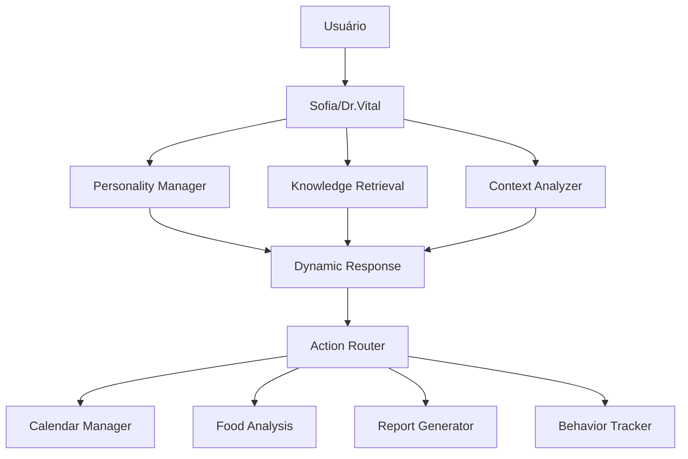

# 🤖 ARQUITETURA MULTI-AGENTE IA - PLATAFORMA SAÚDE

## 📊 **ANÁLISE DO SISTEMA ATUAL**

### ✅ **SISTEMA EXISTENTE:**
- **Sofia (Gemini Flash)**: Chat diário, análise de imagens, análise emocional
- **Dr. Vital (Gemini Flash)**: Relatórios semanais, análise médica
- **Configurações Dinâmicas**: Tabela `ai_configurations` para modelos/parâmetros
- **Edge Functions**: 22 funções especializadas no Supabase
- **Dados Contextuais**: Perfil, peso, missões, conversas, análises emocionais

---

## 🏗️ **ARQUITETURA PROPOSTA - SISTEMA EXPANDIDO**

### 1. 🧠 **SISTEMA DE PERSONALIDADE DINÂMICA**

#### **Tabela: `ai_personalities`**
```sql
CREATE TABLE ai_personalities (
  id UUID PRIMARY KEY DEFAULT gen_random_uuid(),
  user_id UUID REFERENCES auth.users(id),
  agent_name VARCHAR(50), -- 'sofia' | 'dr_vital'
  
  -- Personalidade Base
  tone VARCHAR(20) DEFAULT 'friendly', -- friendly, professional, casual, energetic
  communication_style VARCHAR(20) DEFAULT 'supportive', -- supportive, direct, motivational
  emotional_intelligence NUMERIC(3,2) DEFAULT 0.8, -- 0.0 - 1.0
  energy_level VARCHAR(20) DEFAULT 'balanced', -- low, balanced, high, dynamic
  
  -- Contexto Comportamental
  role_preference VARCHAR(30) DEFAULT 'coach', -- coach, friend, therapist, guide, mentor
  response_length VARCHAR(20) DEFAULT 'medium', -- short, medium, long, adaptive
  use_emojis BOOLEAN DEFAULT true,
  formality_level NUMERIC(3,2) DEFAULT 0.5, -- 0.0 casual - 1.0 formal
  
  -- Especialização
  focus_areas TEXT[] DEFAULT ARRAY[]::TEXT[], -- nutrition, fitness, mental_health, habits
  expertise_level VARCHAR(20) DEFAULT 'general', -- general, specialized, expert
  
  -- Adaptação Temporal
  morning_personality JSONB DEFAULT '{}',
  afternoon_personality JSONB DEFAULT '{}',
  evening_personality JSONB DEFAULT '{}',
  
  -- Configurações Avançadas
  context_memory_depth INTEGER DEFAULT 10, -- quantas conversas lembrar
  proactivity_level NUMERIC(3,2) DEFAULT 0.7, -- quão proativa é
  learning_rate NUMERIC(3,2) DEFAULT 0.1, -- velocidade de adaptação
  
  created_at TIMESTAMPTZ DEFAULT NOW(),
  updated_at TIMESTAMPTZ DEFAULT NOW()
);
```

#### **Edge Function: `personality-manager`**
```typescript
// Gerencia personalidades dinâmicas
interface PersonalityRequest {
  userId: string;
  agentName: 'sofia' | 'dr_vital';
  context?: {
    timeOfDay: string;
    userMood: string;
    recentInteractions: any[];
  };
}

// Retorna personalidade adaptada ao contexto atual
async function getAdaptivePersonality(userId: string, context: any): Promise<PersonalityConfig>
```

---

### 2. 📚 **SISTEMA DE CONHECIMENTO DINÂMICO**

#### **Tabela: `knowledge_base`**
```sql
CREATE TABLE knowledge_base (
  id UUID PRIMARY KEY DEFAULT gen_random_uuid(),
  
  -- Metadados
  title VARCHAR(200) NOT NULL,
  category VARCHAR(50), -- protocols, documents, guidelines, faq
  priority_level INTEGER DEFAULT 5, -- 1-10, 10 = máxima prioridade
  source_type VARCHAR(30), -- manual_upload, api_import, user_generated
  
  -- Conteúdo
  content TEXT NOT NULL,
  content_embeddings VECTOR(1536), -- Para busca semântica
  tags TEXT[] DEFAULT ARRAY[]::TEXT[],
  keywords TEXT[] DEFAULT ARRAY[]::TEXT[],
  
  -- Contexto de Aplicação
  applicable_agents TEXT[] DEFAULT ARRAY['sofia', 'dr_vital']::TEXT[],
  context_rules JSONB DEFAULT '{}', -- Quando aplicar este conhecimento
  override_general_knowledge BOOLEAN DEFAULT true,
  
  -- Versionamento
  version INTEGER DEFAULT 1,
  parent_id UUID REFERENCES knowledge_base(id),
  
  -- Controle
  is_active BOOLEAN DEFAULT true,
  expires_at TIMESTAMPTZ,
  created_by UUID REFERENCES auth.users(id),
  created_at TIMESTAMPTZ DEFAULT NOW(),
  updated_at TIMESTAMPTZ DEFAULT NOW()
);
```

#### **Edge Function: `knowledge-retrieval`**
```typescript
// Busca conhecimento relevante baseado no contexto
interface KnowledgeQuery {
  query: string;
  agentName: string;
  context: {
    userProfile: any;
    conversationHistory: any[];
    currentTopic: string;
  };
}

// Retorna conhecimento priorizado e contextualizado
async function retrieveRelevantKnowledge(query: KnowledgeQuery): Promise<KnowledgeResult[]>
```

---

### 3. 📅 **INTEGRAÇÃO GOOGLE CALENDAR**

#### **Tabela: `calendar_integrations`**
```sql
CREATE TABLE calendar_integrations (
  id UUID PRIMARY KEY DEFAULT gen_random_uuid(),
  user_id UUID REFERENCES auth.users(id),
  
  -- Credenciais OAuth
  google_access_token TEXT,
  google_refresh_token TEXT,
  token_expires_at TIMESTAMPTZ,
  
  -- Configurações
  default_calendar_id VARCHAR(200),
  timezone VARCHAR(50) DEFAULT 'America/Sao_Paulo',
  
  -- Preferências
  auto_create_events BOOLEAN DEFAULT false,
  require_confirmation BOOLEAN DEFAULT true,
  default_event_duration INTEGER DEFAULT 60, -- minutos
  
  -- Controle
  is_active BOOLEAN DEFAULT true,
  last_sync_at TIMESTAMPTZ,
  created_at TIMESTAMPTZ DEFAULT NOW()
);
```

#### **Edge Function: `calendar-manager`**
```typescript
interface CalendarAction {
  userId: string;
  action: 'create' | 'update' | 'delete' | 'list' | 'check_conflicts';
  eventData?: {
    title: string;
    description?: string;
    startTime: string;
    endTime: string;
    guests?: string[];
    reminders?: number[]; // minutos antes
  };
  preferences?: {
    requireConfirmation: boolean;
    checkConflicts: boolean;
    suggestAlternatives: boolean;
  };
}

// Gerencia eventos do Google Calendar via Sofia
async function manageCalendarEvent(action: CalendarAction): Promise<CalendarResult>
```

---

### 4. 📸 **SISTEMA AVANÇADO DE ANÁLISE DE IMAGENS**

#### **Tabela: `food_image_analysis`** (expandir existente)
```sql
ALTER TABLE food_image_analysis ADD COLUMN IF NOT EXISTS
  -- Detecção Avançada
  detected_items JSONB DEFAULT '{}', -- Lista detalhada de itens
  portion_analysis JSONB DEFAULT '{}', -- Análise de porções
  nutrition_breakdown JSONB DEFAULT '{}', -- Macros e micros detalhados
  
  -- Contexto Temporal
  meal_type VARCHAR(20), -- breakfast, lunch, dinner, snack
  eating_context VARCHAR(30), -- home, restaurant, work, social
  
  -- Análise Comportamental
  eating_patterns JSONB DEFAULT '{}',
  emotional_context VARCHAR(50), -- stress_eating, celebration, routine
  
  -- Integração com Metas
  goal_alignment_score NUMERIC(3,2), -- 0.0 - 1.0
  recommendations TEXT[],
  warnings TEXT[];
```

#### **Edge Function: `advanced-food-analysis`**
```typescript
interface FoodAnalysisRequest {
  imageUrl: string;
  userId: string;
  context: {
    mealType?: string;
    timeOfDay: string;
    location?: string;
    mood?: string;
  };
  analysisDepth: 'basic' | 'detailed' | 'comprehensive';
}

// Análise completa com recomendações personalizadas
async function analyzeFood(request: FoodAnalysisRequest): Promise<ComprehensiveFoodAnalysis>
```

---

### 5. 📊 **SISTEMA DE RELATÓRIOS INTELIGENTES**

#### **Tabela: `health_reports`**
```sql
CREATE TABLE health_reports (
  id UUID PRIMARY KEY DEFAULT gen_random_uuid(),
  user_id UUID REFERENCES auth.users(id),
  
  -- Metadados do Relatório
  report_type VARCHAR(30), -- weekly, monthly, quarterly, custom
  period_start DATE,
  period_end DATE,
  generated_by VARCHAR(20) DEFAULT 'dr_vital',
  
  -- Dados Analisados
  data_sources JSONB DEFAULT '{}', -- Quais dados foram incluídos
  metrics_analyzed JSONB DEFAULT '{}', -- Métricas calculadas
  
  -- Conteúdo do Relatório
  executive_summary TEXT,
  detailed_analysis JSONB DEFAULT '{}',
  recommendations TEXT[],
  action_items JSONB DEFAULT '{}',
  
  -- Visualizações
  charts_data JSONB DEFAULT '{}',
  visual_elements JSONB DEFAULT '{}',
  
  -- Distribuição
  email_sent BOOLEAN DEFAULT false,
  whatsapp_sent BOOLEAN DEFAULT false,
  pdf_generated BOOLEAN DEFAULT false,
  
  -- Controle
  is_draft BOOLEAN DEFAULT true,
  published_at TIMESTAMPTZ,
  created_at TIMESTAMPTZ DEFAULT NOW()
);
```

#### **Edge Function: `intelligent-report-generator`**
```typescript
interface ReportRequest {
  userId: string;
  reportType: 'weekly' | 'monthly' | 'custom';
  period: { start: string; end: string };
  includeData: {
    weight: boolean;
    missions: boolean;
    conversations: boolean;
    emotions: boolean;
    food: boolean;
    calendar: boolean;
  };
  format: 'email' | 'whatsapp' | 'pdf' | 'all';
  personalizedInsights: boolean;
}

// Gera relatórios personalizados com IA
async function generateIntelligentReport(request: ReportRequest): Promise<HealthReport>
```

---

### 6. 🧠 **SISTEMA DE LÓGICA COMPORTAMENTAL**

#### **Tabela: `behavioral_patterns`**
```sql
CREATE TABLE behavioral_patterns (
  id UUID PRIMARY KEY DEFAULT gen_random_uuid(),
  user_id UUID REFERENCES auth.users(id),
  
  -- Padrão Identificado
  pattern_type VARCHAR(50), -- habit, trigger, emotional_response, goal_deviation
  pattern_name VARCHAR(100),
  description TEXT,
  confidence_score NUMERIC(3,2), -- 0.0 - 1.0
  
  -- Dados do Padrão
  trigger_conditions JSONB DEFAULT '{}',
  behavioral_response JSONB DEFAULT '{}',
  frequency_data JSONB DEFAULT '{}',
  
  -- Contexto Temporal
  identified_at TIMESTAMPTZ DEFAULT NOW(),
  first_observed DATE,
  last_observed DATE,
  pattern_strength NUMERIC(3,2), -- Força do padrão
  
  -- Intervenções
  intervention_suggestions JSONB DEFAULT '{}',
  success_probability NUMERIC(3,2),
  
  -- Status
  is_active BOOLEAN DEFAULT true,
  intervention_applied BOOLEAN DEFAULT false,
  outcome_tracking JSONB DEFAULT '{}'
);
```

#### **Edge Function: `behavioral-intelligence`**
```typescript
interface BehaviorAnalysisRequest {
  userId: string;
  analysisType: 'pattern_detection' | 'intervention_suggestion' | 'progress_prediction';
  timeframe: 'week' | 'month' | 'quarter';
  focusAreas: string[]; // nutrition, exercise, sleep, emotions
}

// Detecta padrões e sugere intervenções
async function analyzeBehavioralPatterns(request: BehaviorAnalysisRequest): Promise<BehaviorInsights>
```

---

## 🔧 **IMPLEMENTAÇÃO MODULAR**

### **Fase 1: Personalidade Dinâmica (2 semanas)**
1. Criar tabela `ai_personalities`
2. Implementar `personality-manager` edge function
3. Atualizar `health-chat-bot` para usar personalidades
4. Interface admin para configurar personalidades

### **Fase 2: Base de Conhecimento (2 semanas)**
1. Criar tabela `knowledge_base` com embeddings
2. Implementar `knowledge-retrieval` edge function
3. Sistema de upload de documentos
4. Integração com Sofia e Dr. Vital

### **Fase 3: Google Calendar (1 semana)**
1. Configurar OAuth Google Calendar
2. Criar tabela `calendar_integrations`
3. Implementar `calendar-manager` edge function
4. Integrar com Sofia para comandos de calendário

### **Fase 4: Análise Avançada de Imagens (1 semana)**
1. Expandir tabela `food_image_analysis`
2. Melhorar `advanced-food-analysis` edge function
3. Integrar análise comportamental
4. Dashboard de insights nutricionais

### **Fase 5: Relatórios Inteligentes (2 semanas)**
1. Criar tabela `health_reports`
2. Implementar `intelligent-report-generator`
3. Templates visuais avançados
4. Sistema de distribuição automatizada

### **Fase 6: Inteligência Comportamental (3 semanas)**
1. Criar tabela `behavioral_patterns`
2. Implementar `behavioral-intelligence`
3. Algoritmos de detecção de padrões
4. Sistema de intervenções proativas

---

## 🎯 **ARQUITETURA TÉCNICA**

### **Estrutura de Pastas:**
```
supabase/functions/
├── ai-core/
│   ├── personality-manager/
│   ├── knowledge-retrieval/
│   └── behavioral-intelligence/
├── integrations/
│   ├── calendar-manager/
│   └── advanced-food-analysis/
├── reports/
│   └── intelligent-report-generator/
└── utils/
    ├── ai-config-manager/
    ├── embedding-service/
    └── pattern-detector/
```

### **Fluxo de Dados:**


---

## 📈 **BENEFÍCIOS DO SISTEMA**

### **Para Usuários:**
- ✅ **Personalização Total**: IA adaptada ao perfil individual
- ✅ **Conhecimento Especializado**: Respostas baseadas em protocolos específicos
- ✅ **Integração Completa**: Calendário, análises, relatórios unificados
- ✅ **Insights Proativos**: Detecção de padrões e sugestões preventivas

### **Para Administradores:**
- ✅ **Controle Total**: Configuração de personalidades e conhecimento
- ✅ **Modularidade**: Adição/remoção de funcionalidades facilmente
- ✅ **Escalabilidade**: Sistema preparado para crescimento
- ✅ **Analytics**: Métricas detalhadas de uso e eficácia

---

## 🚀 **PRÓXIMOS PASSOS**

1. **Aprovar Arquitetura**: Revisar e ajustar proposta
2. **Definir Prioridades**: Escolher fases para implementação
3. **Configurar Ambiente**: Preparar ferramentas e integrações
4. **Começar Desenvolvimento**: Implementar Fase 1

**Quer que eu comece implementando alguma fase específica?** 🎯